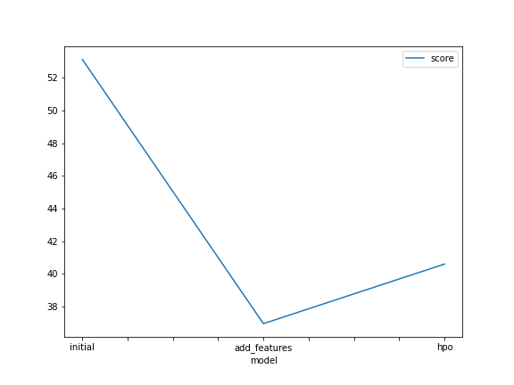
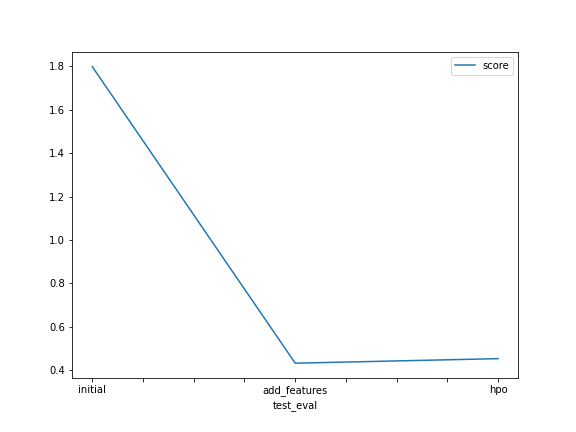

# Report: Predict Bike Sharing Demand with AutoGluon Solution
#### Abdullah Ayad

## Initial Training
### What did you realize when you tried to submit your predictions? What changes were needed to the output of the predictor to submit your results?
The output hadn't negative numbers, so, I didn't have to transform any number to **zeros**.

### What was the top ranked model that performed?
*WeightedEnsemble_L3* with the created new features (score_val: 36.961975 , kaggle_score: 0.43264).

## Exploratory data analysis and feature creation
### What did the exploratory analysis find and how did you add additional features?
There was an int64-typed features and I transformed it into categorical, *season* and *weather* features.
I also parsed the date column, *datetime*, to *year*, *day* and *hour*.

### How much better did your model preform after adding additional features and why do you think that is?
It performed very well, because the created good predictors can make the data more robust.
So, I separated the *datetime* column to make the model learn more about the seasonality paterns and analyze them.

## Hyper parameter tuning
### How much better did your model preform after trying different hyper parameters?
Unfortunately, It didn't perform better than the model with just the created features.

### If you were given more time with this dataset, where do you think you would spend more time?
Feature Engineering, of course. As this is the part that differentiates between the bad model and the good one. (Garbage in, Garbage out), then, I can spend the rest of the time, if any, on the hyperparameters tuning part.

### Create a table with the models you ran, the hyperparameters modified, and the kaggle score.
|model|hpo1|hpo2|hpo3|hpo4|score|
|--|--|--|--|--|--|
|initial|default_vals|default_vals|default_vals|default_vals|1.79810|
|add_features|default_vals|default_vals|default_vals|default_vals|0.43264|
|hpo|GBM(num_leaves): 20, 50|GBM(num_boost_round): 100|NN(dropout_prob): 0.0, 0.6|NN(learning_rate): 0.01, 0.1|0.45345|

### Create a line plot showing the top model score for the three (or more) training runs during the project.

### Create a line plot showing the top kaggle score for the three (or more) prediction submissions during the project.

## Summary
In this project, I used AutoML technique to train a machine learning regression model using AutoGluon library.
After training, I submitted the results of my model to Kaggle and I got a score of 0.43264.
